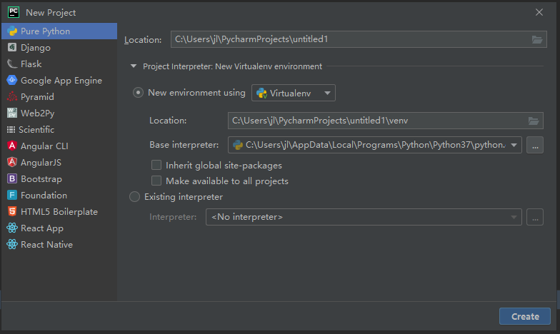
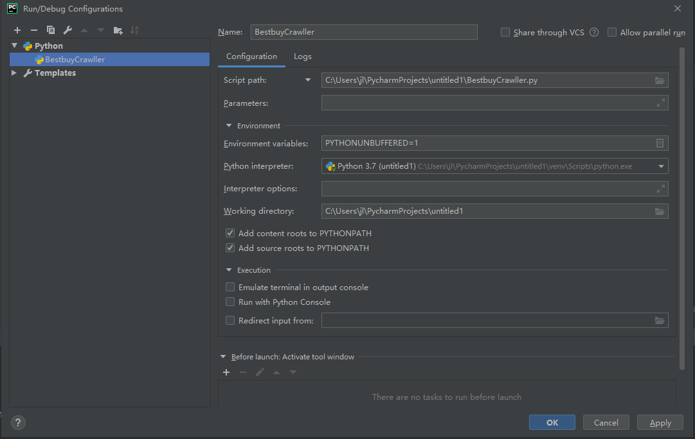

# Assignment 2

BestbuyCrawller will crawl Best Buy <https://www.bestbuy.ca> and print page title and product information.

* Date Created: 02 10 2019
* Last Modification Date: 12 10 2019

## Authors

* [Jiali Jin](jl548339@dal.ca)

## Getting Started

See deployment for notes on how to deploy the project on a live system.

### Prerequisites

To have a local copy of this assingnment up and running on your local machine, you will first need to install the following software / libraries / plug-ins

* Python 3.7
* Libray:
    1. beautifulsoup4 (https://www.crummy.com/software/BeautifulSoup/bs4/doc/)
    2. requests (https://pypi.org/project/requests/)
* IDE: Pycharm

>Note: You can run `BestbuyCrawller.py` in cmd or terminal without PyCharm while it cannot be guarenteed to work successfully. **Therefore, please use PyCharm**

See the following section for detailed step-by-step instructions on how to install this software / libraries / plug-ins

### Installing

1. Installing Python 3.7 : You need to download Python 3.7.4 from <https://www.python.org/downloads/> 

2. Installing PyCharm : You need to download PyCharm from <https://www.jetbrains.com/pycharm/download/#section=windows>
    >Note: `Community version` would be sufficient to run this assignment<br/>

>**Note: To continue, you need to open PyCharm and set settings**

3. Installing Beautifulsoup4 : 
    Run following command in `Pycharm` > `Terminal`

    ```bash
        pip install beautifulsoup4
    ```

    The following contents will appear if `beautifulsoup4` is installed successfully
    >Installing collected packages: soupsieve, beautifulsoup4
    >Successfully installed beautifulsoup4-4.8.1 soupsieve-1.9.4

4. Installing requests : 
    Run following command in `Pycharm` > `Terminal`

    ```bash
        pip install requests
    ```

    The following contents will appear if `requests` is installed successfully
    >Installing collected packages: certifi, chardet, urllib3, idna, requests
    >Successfully installed certifi-2019.9.11 chardet-3.0.4 idna-2.8 requests-2.22.0 urllib3-1.25.6

---
Install without PyCharm (This may fail due to different environments or OS, PyCharm is recommanded):
* You need to install `pip` to run pip commands. [pip installation](https://pip.pypa.io/en/stable/installing/)
* After using pip to install Beautifusoup4 and requests, you can run BestbuyCrawller.py. However, all related libraries and scripts must be in one folder.

```bash
    #In Windows OS, open cmd and run the following command:
        py ~/BestbuyCrawller.py  # the path of BestbuyCrawller.py refers to the folder path. This folder contains related libraries and scripts.
    OR
        ~/python.exe ~/BestbuyCrawller.py #the first path is python folder path, the second path is BestbuyCrawller.py's path.
    
    #In Mac OS, open terminal and run the following command under the folder that contains related libraries and scripts
        python BestbuybuyCrawller.py 
```
---

## Deployment

1. Set up PyCharm
   Open Pycharm and click **create a new project**
   Choose `Pure Python`
   Set Project Interpreter as the image shows
   The `Base interpreter` refers to the path of where your python is installed
   

    >**Note: You need to install Beautifulsoup4 and requests before you do the following steps to run the program.**
    Please go to Installing section if you havn't installed.

2. Copy the BestbuyCrawller.py to the project location.

    >**Note: `BestbuyCrawller.py` shouldn't not copy to `.idea` or `venv` folder**

3. Choose Run > Add Configurations > click `+` symbol and choose python
4. Set `Script path` to the `BestbuyCrawller.py` under your work directory
5. Set `Python interpreter` to Python 3.7
6. Set `Working directory` to the path of your project
7. Click after set up
8. Click Run and choose the configuration you set up
   Note: The following image is an example of `Run Configurations`
   
